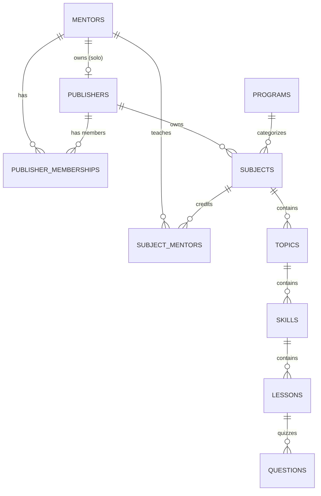
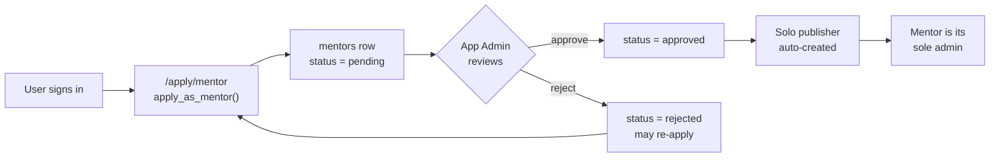
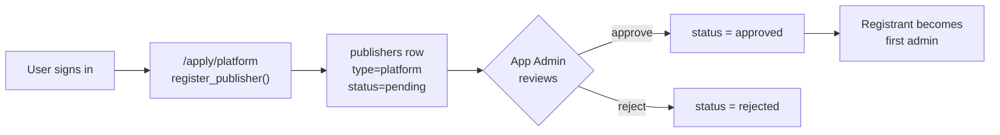
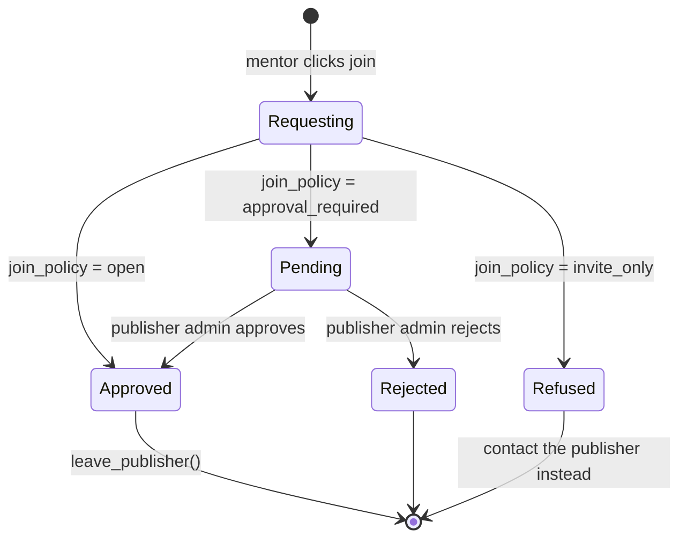
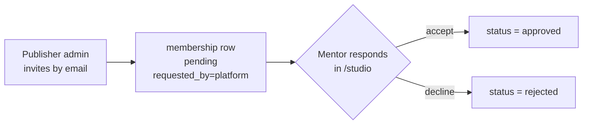

# Architecture

How Feyn is put together: the multi-tenant ownership model, who may do what, how content reaches the public site, and where each concern lives in the code.

Companion documents: [`docs/schema.sql`](docs/schema.sql) is the canonical schema, [`docs/permissions.md`](docs/permissions.md) is the full policy reference, [`docs/self-hosting.md`](docs/self-hosting.md) is the setup walkthrough.

---

## The one idea everything follows

**A Publisher is anything that can own courses.** Not two systems for "independent mentors" and "organisations" — one, with a `type` column.

- `type = 'platform'` — an organisation or brand. Registered by someone, approved by an app admin, then run by its own admins.
- `type = 'solo'` — auto-created when a mentor application is approved. Exactly one member: that mentor, as `admin`.

Every course belongs to exactly one Publisher. Every Publisher has members with a role. That is the whole ownership model.

**A Mentor is a person, separate from any membership.** Bio, credentials, avatar, certificate signature, socials, a public `@username`. Mentors hold memberships in any number of Publishers at once, with an independently assigned role in each.

This is what lets one person teach physics under Platform A, chemistry under Platform B and publish mathematics independently — simultaneously, through one membership table rather than three parallel systems. Losing a platform membership never touches the Mentor record or their solo Publisher.

---

## Entity relationships



`programs` is shared taxonomy — "HSC", "SSC", "Interests" — owned by nobody and writable only by app admins. Everything from `subjects` down inherits its Publisher for permission purposes.

`subject_mentors` is a many-to-many join, and it is **not just a label**. Credit is a permission grant: a member with the `mentor` role can edit exactly the courses they are credited on. That is why only a Publisher admin may write to it, and only for mentors who actually hold an approved membership in that Publisher.

---

## Permissions

Two independent axes: **global** (`app_admins`) and **per-publisher** (`publisher_memberships.role`).

| Actor | Can edit |
|---|---|
| App Admin | Everything, everywhere. Approves mentor applications and platform registrations. |
| Publisher `admin` (Publisher X) | X's settings, branding and `join_policy`; members of X; any course under X |
| Publisher `editor` (Publisher X) | Any course under X. Not members, not settings. |
| Publisher `mentor` (Publisher X) | Only courses under X where they are credited. |
| Mentor, no memberships | Only courses under their own solo Publisher. |
| Regular user | Nothing editable. Browse, enroll, track progress. |

Permissions are **computed per request** as `isAppAdmin OR membership.role for that publisher_id`. There is no flat role stored on a user anywhere. An App Admin needs no membership row to act on a Publisher — global power is deliberately separate from the membership table, which represents actual affiliation only.

In code: [`lib/permissions.js`](lib/permissions.js) resolves a caller's full permission set in three queries; [`lib/usePermissions.js`](lib/usePermissions.js) caches it per session and invalidates on auth change or membership mutation. In the database: `has_publisher_role(pub_id, min_role)` is the single authorization primitive, ranking `admin 3 > editor 2 > mentor 1`.

The UI decides what to **render**. The database decides what is **allowed**. Both consult the same rules, and neither trusts the other.

---

## Approval flows

### Becoming a mentor



Approval and solo-publisher creation are **one transaction**, and idempotent — re-approving changes nothing. If the mentor's username is already taken in the publisher namespace, the slug is auto-suffixed rather than failing.

Self-approval is impossible: `mentors_update_self` lets you update your own row, and `guard_mentor_columns()` silently restores `status`. The statement succeeds and changes nothing.

### Registering a platform



`review_publisher_registration()` refuses `type = 'solo'` rows outright — those only ever come from mentor approval.

### Mentor joins a platform

`join_policy` is a per-Publisher setting, changeable anytime by its admins, and works like a Google Drive sharing setting:



| `join_policy` | Behaviour |
|---|---|
| `open` | Any approved mentor joins instantly as `mentor`. "Anyone with the link can edit." |
| `approval_required` *(default)* | Request lands `pending` in that Publisher's admin queue. "Anyone can request access." |
| `invite_only` | No self-serve joining at all. "Restricted — only people added directly." |

**Platform-initiated invites always require the mentor's acceptance**, whatever the `join_policy`. The policy governs only *mentor-initiated* joining. Invitations land `pending` in the mentor's inbox at `/studio` either way.



### Leaving

Either side can end an approved membership at any time, with no approval step. Courses stay with the Publisher — an admin must reassign or archive orphaned ones. A mentor's solo Publisher and other memberships are untouched.

**A Publisher can never drop to zero admins.** Enforced in `set_membership_role`, `leave_publisher` and `remove_publisher_member` alike, so there is no ordering of operations that orphans a Publisher.

---

## Public URLs

Two independently-unique namespaces, like Reddit's `/u/` and `/r/`:

- `/m/{username}` — mentor profile, aggregating every course they are credited on across every Publisher, each badged with its owner
- `/p/{slug}` — publisher page: branding, members, published courses
- `/p/{slug}/dashboard` — members, queues, `join_policy`, courses (auth-gated)

Handles are 3–30 characters of `[a-z0-9_-]`, no leading or trailing separator, no consecutive hyphens, checked against a shared reserved-word list. Uniqueness is case-insensitive via normalized indexes. The rules live in `validate_handle()` and are mirrored in [`lib/handles.js`](lib/handles.js) purely for instant feedback — the database re-validates every submission.

Availability is a boolean-only public RPC (`is_handle_available`), debounced ~400 ms by [`components/HandleField.js`](components/HandleField.js). Boolean-only so it never leaks who owns a handle.

Changes are rate-limited server-side: one per 14 days, five per lifetime, then an app admin must do it manually. Old handles are recorded in `mentor_username_history` / `publisher_slug_history`, **count as taken**, and 301-redirect forward — so shared links do not rot and never repoint at a new owner.

---

## Content pipeline

```
programs → subjects → topics → skills → lessons → questions
```

Reads flow through one module. [`data/courseHelpers.js`](data/courseHelpers.js) is the only place that queries content tables for public pages, and it maps schema field names to the flat shapes the UI has always used:

| UI reads | Schema has |
|---|---|
| `lesson.videoId` | `lessons.video_url` (id extracted from any YouTube URL form) |
| `lesson.duration` `"~15:00"` | `lessons.duration_seconds` |
| `subject.comingSoon` | `subjects.status != 'published'` |
| `subject.certificate` | `subjects.has_certificate` |
| `subject.coaches[]` | `subject_mentors → mentors` |
| `program.type` | `programs.kind` |
| `q.type`, `q.correct`, `q.answer`, `q.aliases`, `q.pairs`, `q.modelAnswer` | `questions.kind` + `options`/`answer` jsonb |

Mapping in the query layer rather than renaming fields across every component keeps the ~800-line question engine and `lib/userStore.js` untouched. `mapQuestion()` and `unmapQuestion()` are exact inverses, so the editor and the player can never disagree about an encoding.

**Rendering.** All five content routes use ISR: `revalidate: 60` plus `fallback: 'blocking'`. An edit appears within a minute with no redeploy; a URL that did not exist at build time is rendered on first request and cached. This is the reason for moving off `fallback: false`.

Build-time reads use the **anon key with RLS on**, so a draft course cannot leak into a cached page even by mistake. Dashboards are client-fetched and never statically generated — they are behind auth and always need fresh data.

Netlify needs `@netlify/plugin-nextjs` for any of this to work; without it the output is served as static files and every regenerating route 404s.

**Progress keys.** Learner progress is keyed by slug path (`hsc/physics/dynamics/…`), not UUID, so the client computes the key from the URL it is already on with no extra round-trip and a learner's history stays readable. The trade-off is real: renaming a published slug orphans progress rows, which is why it is an app-admin action.

---

## Code layout

| Path | Responsibility |
|---|---|
| `lib/supabase.js` | Browser client singleton. Hand-rolled auth fetch — **read its header comment before touching it**, it documents three prior failed fixes. |
| `lib/supabaseServer.js` | Anon (RLS on), token-scoped, and service-role clients. Server-only. |
| `lib/permissions.js` | Request-scoped permission resolution. The only place that answers "can they edit X". |
| `lib/usePermissions.js` | Session-cached React wrapper over the above. |
| `lib/handles.js` | Client mirror of `validate_handle()` plus cooldown arithmetic. |
| `lib/api.js` | Browser → API-route helpers, including `callRpc`. |
| `lib/catalog.js` | Shared client-side catalogue cache for the six surfaces that need it. |
| `lib/userStore.js` | Learner state: enrollment, progress, certificates. localStorage first, DB-backed. |
| `data/courseHelpers.js` | Content queries and the schema→UI mapping. |
| `pages/api/rpc/[fn].js` | Allowlisted RPC gateway. Runs as the caller, never the service role. |
| `pages/apply/*` | Mentor application, platform registration. |
| `pages/m/[username].js`, `pages/p/[slug]/` | Public profiles and publisher pages. |
| `pages/studio/` | Mentor studio: memberships, invitations, handle settings. |
| `pages/panels/` | Course editor and credits/publishing. |
| `pages/admin.js` | App-admin queues and global override. |

Mutations go through `/api/rpc/[fn]`, an **allowlist** — adding a function to the schema never accidentally publishes an endpoint. It runs with the caller's bearer token, so RLS and every internal `auth.uid()` check still apply. It is a gateway, not a bypass. Direct table writes are used where an RLS policy already governs the column: course content, `join_policy`.

---

## Design decisions worth knowing

Each of these is load-bearing; changing one means revisiting the whole schema.

**`publisher_memberships` has no client-facing write policies.** Every transition goes through an RPC, so `join_policy` enforcement lives in exactly one place instead of being duplicated across policies.

**Privileged columns are protected by BEFORE UPDATE triggers, not RLS.** A `with check` that compares NEW against the stored row recurses through its own policy and errors at runtime. The triggers silently restore `status`, `approved_by`, `username`/`slug` and the change counters. The service role bypasses RLS but **not** these triggers.

**A policy on table X must not call a function that selects from table X.** `supabase-js` appends `RETURNING` to every insert; Postgres re-checks the SELECT policy against the new row; a `stable` function's snapshot predates the statement. Hence the `*_row` helper forms that take columns as arguments. Full explanation in [`docs/permissions.md`](docs/permissions.md).

**`anon` needs EXECUTE on policy helpers.** Policy predicates evaluate as the querying role, so removing those grants to look tighter breaks the public site. They are safe: each returns a boolean about `auth.uid()`, which is null for `anon`.

**There is no in-app bootstrap for the first App Admin.** On a fresh fork that would let the first visitor claim the site. `app_admins` has no INSERT policy at all; the first admin is created by SQL in the Supabase editor, and `grant_app_admin()` requires already being one.

**RLS refuses UPDATE and DELETE silently.** With no matching policy the statement succeeds and affects zero rows rather than raising. Client code must check the affected-row count. The same is true of the guard triggers.

**Certificates carry denormalized `publisher_name` and `mentor_names`**, so an issued certificate stays truthful after the course is edited, the Publisher renames itself, or the mentor leaves.

**Questions use `kind` + `options`/`answer` jsonb** for all five engine shapes (`mcq`, `fill`, `tap-correct`, `explain`, `match`) rather than five sets of nullable typed columns. The shapes have nothing in common; the encoding is documented inline above the table.

---

## Verification

```bash
npm run build          # must pass
npm run pg:start       # throwaway Postgres 18 — no Docker, no sudo
npm run schema:apply   # → "schema: APPLIED CLEAN"
npm run test:schema    # → "173 passed, 0 failed"
npm run pg:stop
```

`tests/schema.test.js` asserts 173 behaviours against a real Postgres: RLS evaluation, `security definer` semantics, trigger side effects, every refusal message. None of that can be mocked, which is why the suite needs a real database.

**Never point the harness at a real Supabase project** — `docs/schema.sql` begins by dropping every Feyn table.
